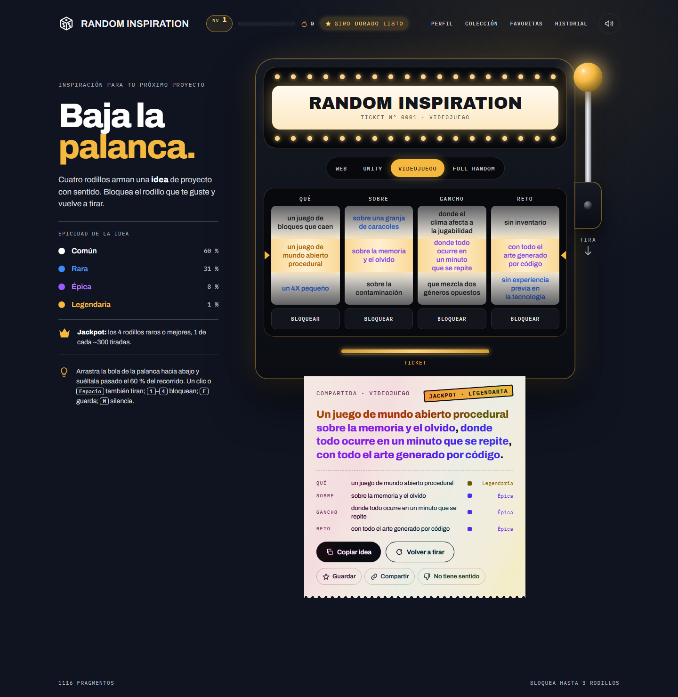

# Random Inspiration

**Una tragaperras de ideas para tu próximo proyecto.** Baja la palanca, giran cuatro rodillos y sale impresa en un ticket una idea de proyecto web, de Unity o de videojuego que tiene sentido.

**▶ Pruébala: [krost22.github.io/Random-Inspiration](https://krost22.github.io/Random-Inspiration/)**



> *«Un juego de mundo abierto procedural sobre la memoria y el olvido, donde todo ocurre en un minuto que se repite, con todo el arte generado por código.»* (ticket **Jackpot · Legendaria**)

---

## Cómo funciona

Cada tirada arma una frase con cuatro rodillos:

| Rodillo | Rol | Ejemplo |
|---|---|---|
| **Qué** | la base del proyecto | *un roguelike de cartas* |
| **Sobre** | el tema | *sobre una panadería de madrugada* |
| **Gancho** | el giro que lo hace único | *donde cada carta jugada se quema* |
| **Reto** | una restricción o tecnología | *jugable con un solo botón* |

- **Más de 1000 fragmentos** (242 · 322 · 285 · 267), con **cientos de millones de combinaciones válidas** por modo.
- **Combinaciones con sentido:** cada fragmento lleva etiquetas de lo que necesita y de lo que no admite (una CLI nunca sale «con Vue» y un juego de estrategia nunca sale «donde la luz te hace daño»).
- **Cuatro modos:**
  - **Web:** apps, extensiones, bots, APIs.
  - **Unity:** juegos, herramientas de editor, AR/VR, simulaciones, con tecnología de Unity.
  - **Videojuego:** géneros y restricciones de game jam, con cualquier motor.
  - **Full Random:** mezcla los tres.

### Rarezas y jackpot

Cada fragmento tiene una rareza, y la suma de las cuatro da la epicidad de la idea:

| Epicidad | Probabilidad |
|---|---|
| ⚪ Común | 60 % |
| 🔵 Rara | 31 % |
| 🟣 Épica | 8 % |
| 🟡 Legendaria | 1 % |

**Jackpot:** los cuatro rodillos salen raros o mejores, más o menos 1 de cada 300 tiradas. Destello, temblor, lluvia dorada y ticket holográfico.

## Características

- **Una máquina de verdad:** palanca física que se arrastra con el ratón o el dedo, rodillos que frenan uno a uno con rebote y marquesina de bombillas.
- **Anticipación:** si los tres primeros rodillos salen raros, el cuarto frena despacio mientras suena un latido.
- **Sonido sintetizado** con WebAudio (sin archivos de audio): trinquete, tics, campanas por rareza, impresora de tickets y arpegio de jackpot.
- **Partículas, temblor y vibración** en el móvil, todo desactivable con `prefers-reduced-motion`.
- **Bloquear rodillos:** fija el que te guste y vuelve a tirar el resto.
- **Progresión:**
  - XP y niveles que desbloquean skins: Noche dorada, Plata, Neón, Esmeralda y Rubí.
  - Racha diaria, con un **giro dorado** al día.
  - **Pity timer:** tras 30 tiradas sin una idea épica, la siguiente lo es seguro.
  - 16 logros.
- **Colección** de fragmentos descubiertos, **favoritas** (exportables a Markdown y JSON), **historial** de las últimas 50 tiradas y **enlaces para compartir** una idea exacta.
- **Botón «No tiene sentido»:** anota las combinaciones malas y las exporta en JSON para afinar las etiquetas.

### Controles

| Tecla | Acción |
|---|---|
| `Espacio` / `Enter` | Tirar de la palanca |
| `1`–`4` | Bloquear o desbloquear un rodillo |
| `F` | Guardar la idea en favoritas |
| `M` | Silenciar o activar el sonido |

## Ejecutar en local

No hay dependencias ni paso de build: HTML, CSS y JavaScript con módulos ES nativos. Solo hace falta [Node.js](https://nodejs.org/) para el servidor de desarrollo y el script de comprobación.

```bash
npm run dev      # sirve la app en http://localhost:5173
npm run check    # valida los datos y estima las combinaciones
```

> Abrir `index.html` con doble clic no funciona: el navegador bloquea la carga de `data/*.json` desde `file://`.

## Estructura

```
index.html        la página: máquina, ticket, paneles
style.css         estilo «noche dorada» y skins
src/engine.js     motor puro (sin DOM): pools, reglas, tirada, rarezas
src/slot.js       la máquina: rodillos, palanca, bloqueos, ticket
src/fx.js         sonido, partículas, temblor, destello, vibración
src/meta.js       progresión guardada en localStorage y paneles
data/*.json       los fragmentos de cada rodillo (que, sobre, gancho, reto)
tools/check.js    validación de datos y estadísticas
tools/serve.js    servidor estático mínimo para desarrollo
PLAN.md           el plan del proyecto por fases
```

## Añadir ideas

Cada fragmento es una línea JSON en `data/<rodillo>.json`:

```json
{"id": "g037", "t": "donde cada carta jugada se quema", "m": ["juego"], "needs": ["cartas"], "r": 1}
```

| Campo | Significado |
|---|---|
| `id` | identificador único (letra del rodillo y número) |
| `t` | el texto; un **Qué** empieza por «un» o «una»; máximo 64 caracteres |
| `m` | modos donde aparece (`web`, `unity`, `juego`); si falta, aparece en todos |
| `tags` | lo que aporta el fragmento (`juego`, `3d`, `multijugador`, `oscuro`…) |
| `needs` | el resto de la idea debe traer **al menos una** de estas etiquetas |
| `not` | el resto de la idea **no puede** traer ninguna de estas |
| `r` | rareza: 0 común, 1 rara, 2 épica, 3 legendaria (por defecto 0) |

Además, cada fragmento tiene que compartir al menos un modo con el **Qué**. Después de editar, `npm run check` avisa de ids repetidos, erratas en etiquetas, textos demasiado largos y fragmentos que nunca podrían salir.

## Publicación

La web es estática y se sirve con **GitHub Pages** desde la rama `main`. Cualquier push a `main` la actualiza.

El progreso (XP, colección, favoritas…) se guarda en el `localStorage` del navegador de cada persona: no hay cuentas ni servidor.

## Licencia

[MIT](LICENSE) © 2026 Eduardo De Jesús Mogollón Salcedo
